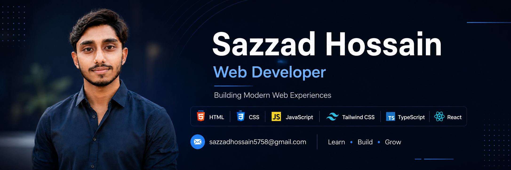

<div align="center">



<h1>👋 Hi, I'm Sheikh Md Sazzad Hossain</h1>

<h3>💻 Web Developer | CSE Student | Future Software Engineer</h3>

<p><strong>Building, Learning & Growing One Project at a Time.</strong></p>

<a href="https://github.com/sm-sazzad">
  
</a>
<a href="https://www.linkedin.com/in/sm-sazzad/">
  
</a>
<a href="mailto:sazzadhossain5758@gmail.com">
  
</a>

</div>

---

## 🧑‍💻 About Me

I'm a Computer Science & Technology student passionate about building modern and user-friendly web experiences. I'm currently strengthening my skills in JavaScript, TypeScript, React, Tailwind CSS, and modern frontend development.

I enjoy learning new technologies, solving programming problems, and turning ideas into real-world projects. My long-term goal is to become a skilled **Software Engineer**, and I'm using Web Development as one of the first steps toward that journey.

---

## 🛠️ Tech Stack

### Languages

<div align="center">
  
</div>

### Frontend

<div align="center">
  
</div>

### Tools

<div align="center">
  
</div>

---

## 📚 Currently Learning

- ⚛️ React
- 🔷 TypeScript
- 🟨 Advanced JavaScript
- 🧠 Data Structures & Algorithms
- 🌐 Modern Frontend Development

---

## 🎓 Education

**Kushtia Polytechnic Institute**  
**Department:** Computer Science & Technology  
**Current Semester:** 6th

---

## 🎯 My Goal

> My ultimate goal is to become a skilled **Software Engineer**.

I'm currently focusing on Web Development to build a strong foundation, gain practical experience, and continuously improve my problem-solving and programming skills. Step by step, I want to grow from building websites and applications into becoming a versatile software engineer.

---

## 📊 GitHub Statistics

<div align="center">
  
  
</div>

---

## 🔥 Contribution Streak

<div align="center">
  
</div>

---

## 📈 GitHub Activity

<div align="center">
  
</div>

---

## 🏆 GitHub Trophies

<div align="center">
  
</div>

---

## 🌐 Coding Profiles

<div align="center">

<a href="https://codeforces.com/profile/sm-sazzad">
  
</a>
<a href="https://www.codechef.com/users/sm_sazzad">
  
</a>

</div>

---

## 🤝 Connect With Me

<div align="center">

<a href="https://www.linkedin.com/in/sm-sazzad/">
  
</a>
<a href="https://www.facebook.com/sazzad.hossain.5758">
  
</a>
<a href="https://x.com/sm_sazzad58">
  
</a>
<a href="mailto:sazzadhossain5758@gmail.com">
  
</a>

</div>

---

## 💡 Developer Mindset

```text
Learn → Build → Solve → Improve → Repeat
```

<div align="center">

### 🚀 Always Learning. Always Building.

⭐ If you find my projects interesting, feel free to explore my repositories!

</div>
